# Práctica 5.1 Github 
## Ejercicios de Git y Github. 

### Configuración Repositorio

Creamos un repositorio con nombre DEAW. 

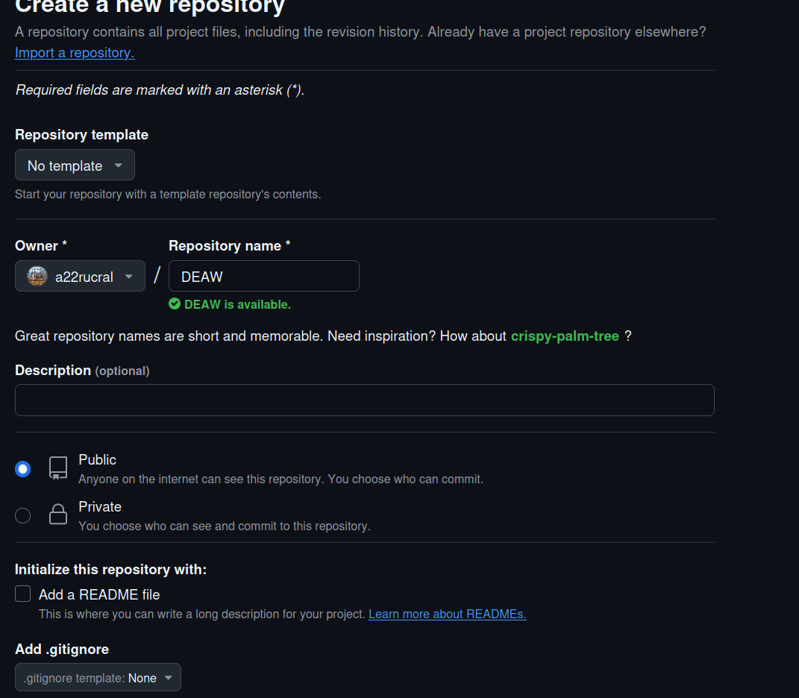

Lo clonamos en nuestro repositorio local.

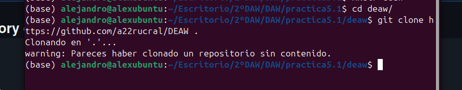

### Manejo Repositorio

Crearemos un readme.md, que nos servirá para tener una descripción del proyecto / documentación. 

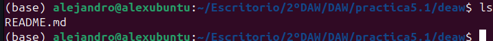

Tras esto lo añadiremos todo a la preparación y haremos un commit con el siguiente comando. 

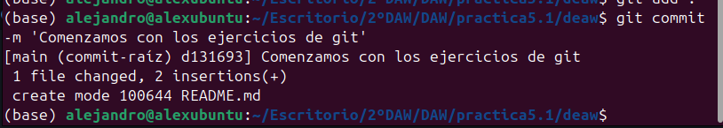

A continuación, con todo preparado, ejecutaremos el siguiente comando para la subida de archivos al repositorio en la nube. 

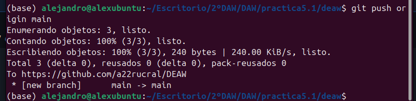

Ahora crearemos el archivo y la carpeta que no queremos que se suba a github. 

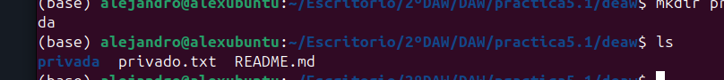

Para que no se suba, existe un archivo, .gitignore, que lo que hace es decirle a git que tipo de archivos o directorios deben ser ignorados y no incluirlos al commit. Con la siguiente manera le decimos que ni privado.txt ni el directorio privada se subirán al repositorio. 

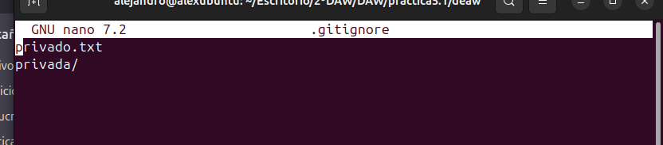

Crearemos un tag con el siguiente comando. Esto nos será de utilidad para marcar un commit de un repositorio para señalizar las versiones y ver el progreso. 

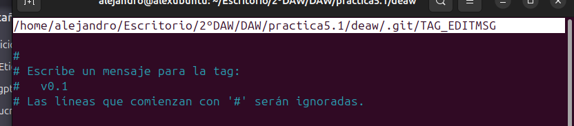

### Manejo Social Github.

Edición de perfil, nos pondremos una foto de perfil. 

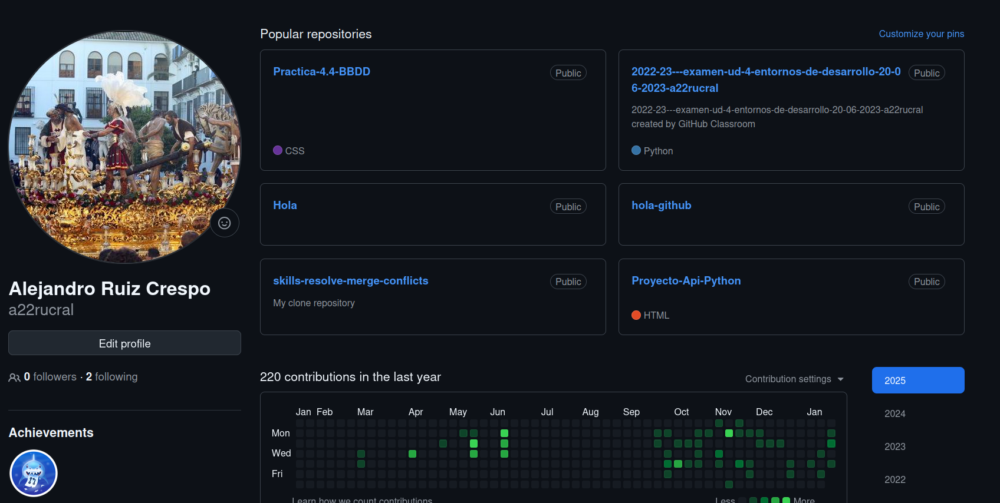

Ajustaremos la configuración de seguridad para que sea de autenticación en dos pasos. 

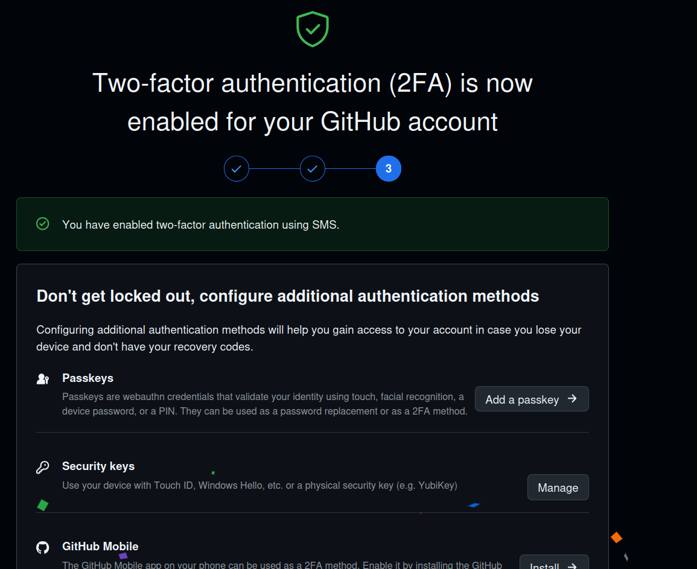

También podremos seguir a nuestros compañeros de trabajo o referentes y darle estrellas a sus repositorios. 


### Manejo Git. 

Estos dos usuarios seguidos previamente los pondremos en el readme.md en formato de tabla con un enlace a su github. 

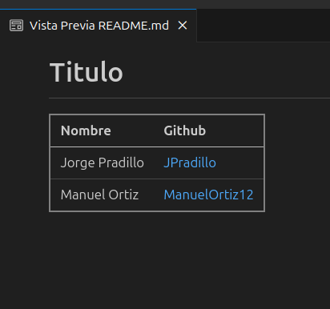

Crearemos la rama V0.2.  Esto nos permitirá gestionar y organizar el desarrollo de nuestro trabajo. 

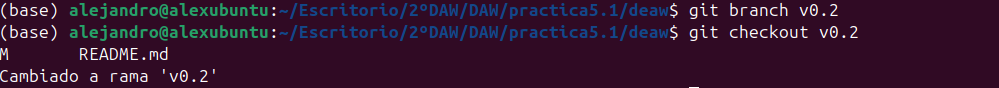

Editaremos el archivo y le haremos un push desde la rama. Tras esto haremos un git merge para fusionar la rama con la rama principal y unificar el trabajo. 

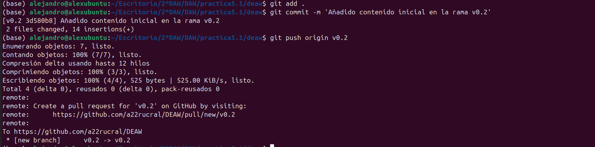


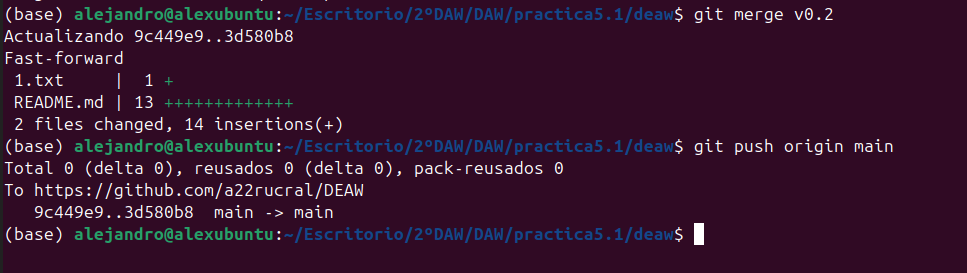

En este caso hemos hecho cambios en el mismo archivo a la vez en distintas ramas de forma que cuando la intentas unificar dará error de conflicto, como en la siguiente captura. 

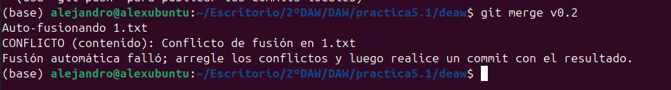

Ejecutaremos los siguientes comandos para listar las ramas unidas a main y las que no.

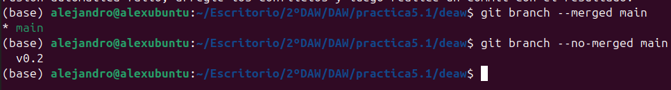

Al irnos de nuevo al archivo nos saldrá de la siguiente manera indicandonos el conflicto entre ramas. Simplemente lo editaremos y arreglaremos el conflicto. 

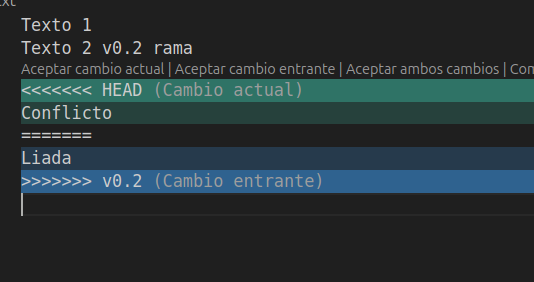


Crearemos un tag que se llama igual que la rama **v0.2**, y la subiremos, pero con una aclaración, ya que le tienes que indicar si te refieres a la rama o al tag. Se lo indicaremos de la siguiente manera como viene en el comando. 

```console
git push origin refs/tags/v0.2  // Para indicarle tag.
git push origin refs/heads/v0.2 // Para indicarle rama.
```
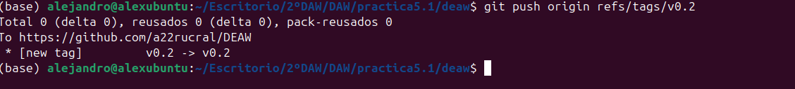

Borraremos la rama v0.2 indicandole que es la rama como anteriormente hemos explicado.

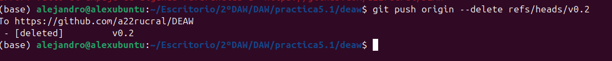

Ejecutaremos el git log para mostrar el historial de los commits.
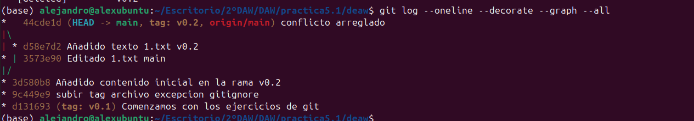

--decorate : Ayuda a identificar en que rama o tag se encuentra cada commit. 
--graph: Muestra una representación gráfica del historial de commits. Incluye líneas y ramas para visualizar como están conectados los commits. 
--oneline: Muestra cada commit en una sola línea. 
--all: Muestra el historial de todas las ramas, no solo de en la que se encuentra. 


## Ejercicios de Git y Github II.
### Ejercicios de creación y actualización de repositorios. 
1. Configurar Git definiendo variables de perfil y activando el coloreado de salida. 

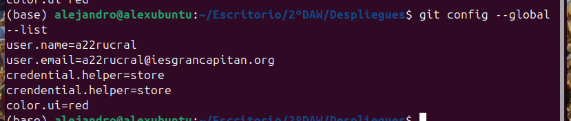


2. Crear un nuevo repositorio cuyo nombre "Libro" y mostrar contenido. 

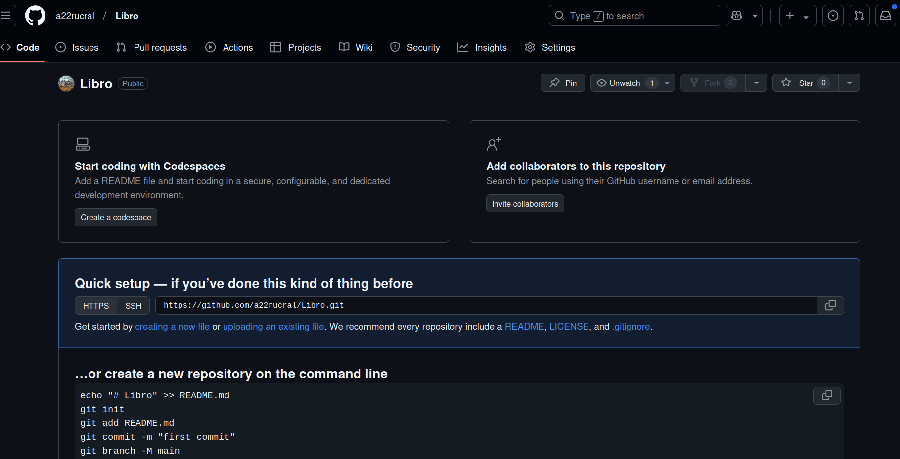


3. Comprobaremos el estado del repositorio, posteriormente crearemos el fichero indice y le añadiremos contenido  y de nuevo revisaremos el estado del repositorio. Tras esto añadiremosel fichero a la zona de intercambio temporal y volveremos a comprobar el estado del repositorio. 

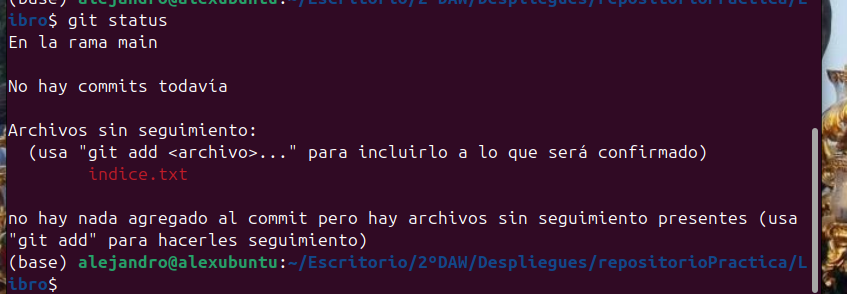
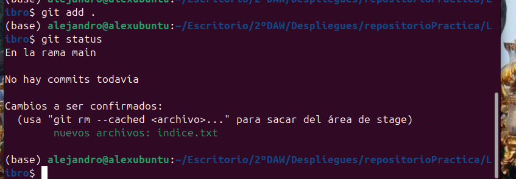

4. Realiza un commit de los últimos cambios con un mensaje y ver estado del repostorio. 


5. Cambiar el ficher indice, mostrar los cambios respecto a la última versión guardada en el repositorio. 

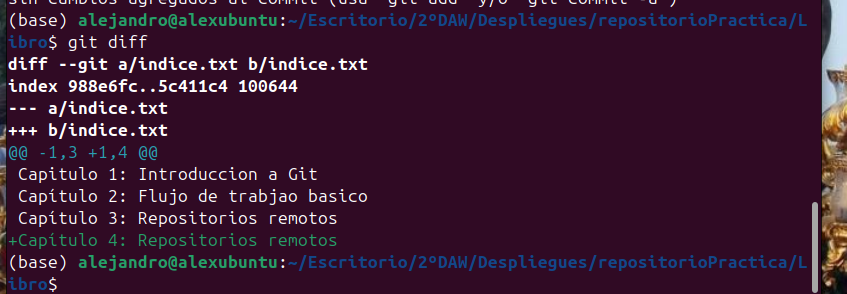


6. Mostrar los cambios de la última versión, cambiar el mensaje del último commit y volver a mostrar los últimos cambios del repositorio. 

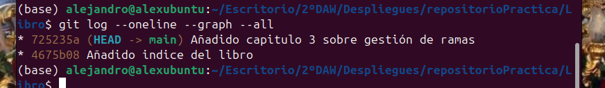

#### Comandos utilizados. 
- git config --global (user.name/user.email/ color.ui.auto) : Configura tu nombre, correo y activa el coloreado de Git. 
- git init : Inicializa un repositorio de Git. 
- git status : Muestra el estado del repositorio. 
- git add .: añade todo lo que esté por añadir al área del staging. 
- git commit : confirma los cambios con un mensaje y verifica que no haya cambios pendientes. 
- git diff : Muestra las diferencias con la última versión confirmada. 
- git log --oneline: Muestra los últimos commits y verfica el historial. 


### Ejercicios de manejo del historial de cambios. 
1. Creamos carpeta de capítulos, añadimos un fichero con contenido para luego añadir los cambios a la zona de intercambio temporal, haremos un commit y luego mostraremos el historial de cambios del repositorio. 

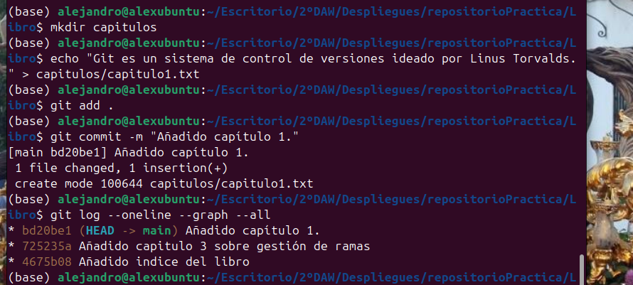


2. Creamos el fichero, añadimos los cambios, hacemos un commit con mensaje y mostramos las diferencias entre la última versión y dos versiones anteriores. 

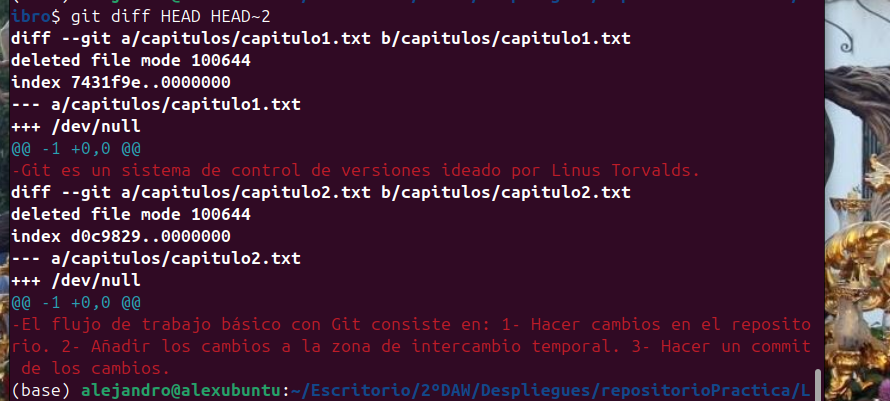

3. Creamos un fichero, añadimos los cambios con un mensaje y mostramos la diferencia entre la primera y ultima version del repositorio.  

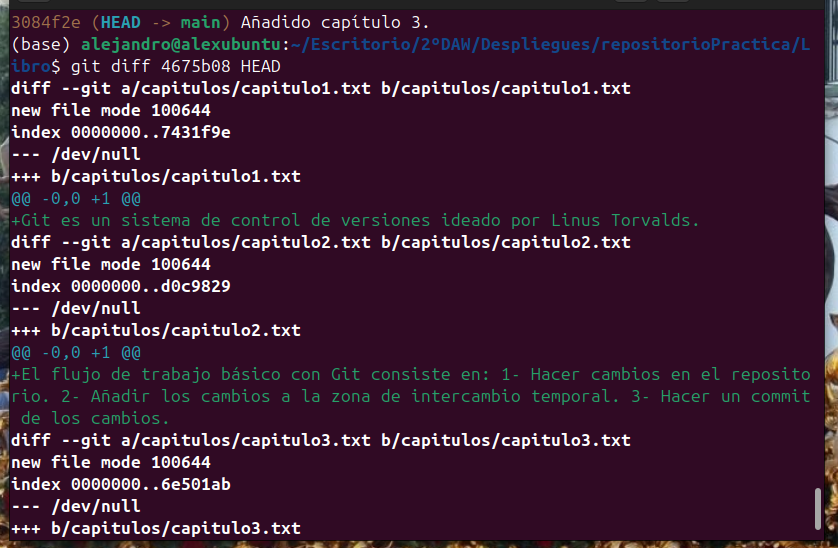

4. Modificar el fichero, añadir los cambios a la zona temporal y hacer un commit con un mensaje, tras esto, mostrar quién ha hecho los cambios. 

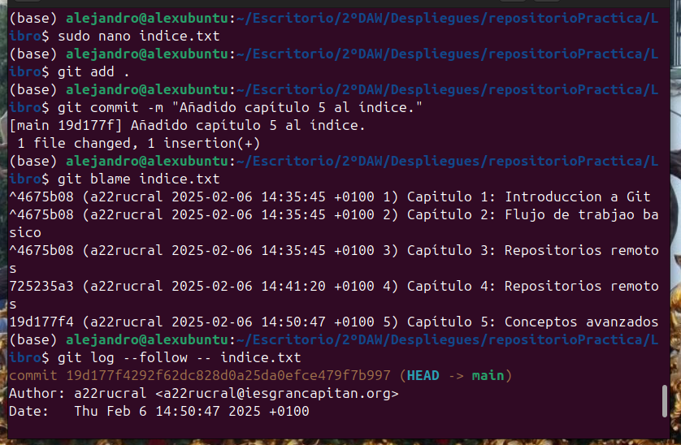

#### Comandos utilizados. 
- git diff HEAD~2 Muestra las diferencias entre la última versión y dos versiones anteriores. Se puede utilizar tambien el número de ID del commit. 
- git blamme  &lt;archivo&gt; muestra quien ha editado el archivo. 


### Ejercicios de deshacer cambios. 
1. Eliminar la ultima línea del fichero y guardarlo, comprobar el estado del repositorio, deshacer los cambios realizados en el fichero para volver a la versión anterior del fichero y volver a comprobar el estado del repositorio. 

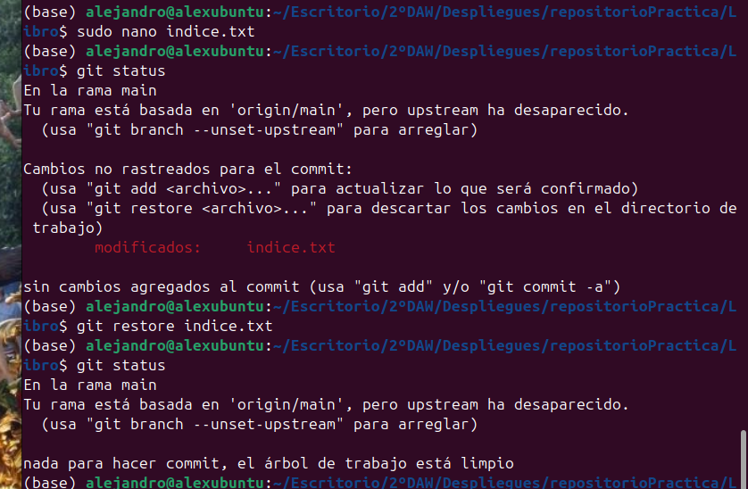

2. Eliminar la ultima línea del fichero, añadirlo a la zona de intercambio, comprobaremos el estado del repositorio, después, quitaremos los cambios de la zona de intercambio temporal pero mantenerlos en el directorio de trabajo. Comprobaremos d enuevo el estado y desharemos los cambios realizados en el fichero para volver a la versión anterior del archivo. 

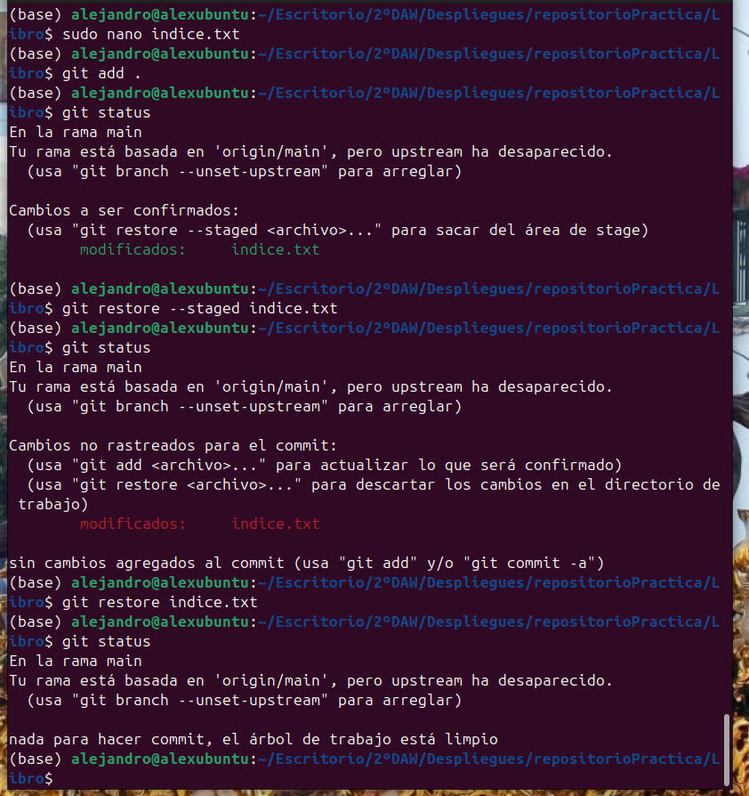

3. En este caso eliminaremos también el fichero, quitando los cambios en la zona de intercambio temporal pero mantenerlos en el directorio de trabajo. 

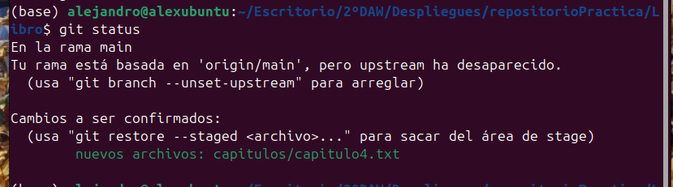

4. Haremos un commit, para luego ver como se puede deshacer manteniendo los cambios anteriores en el directorio de trabajo y la zona de intercambio temporal.  

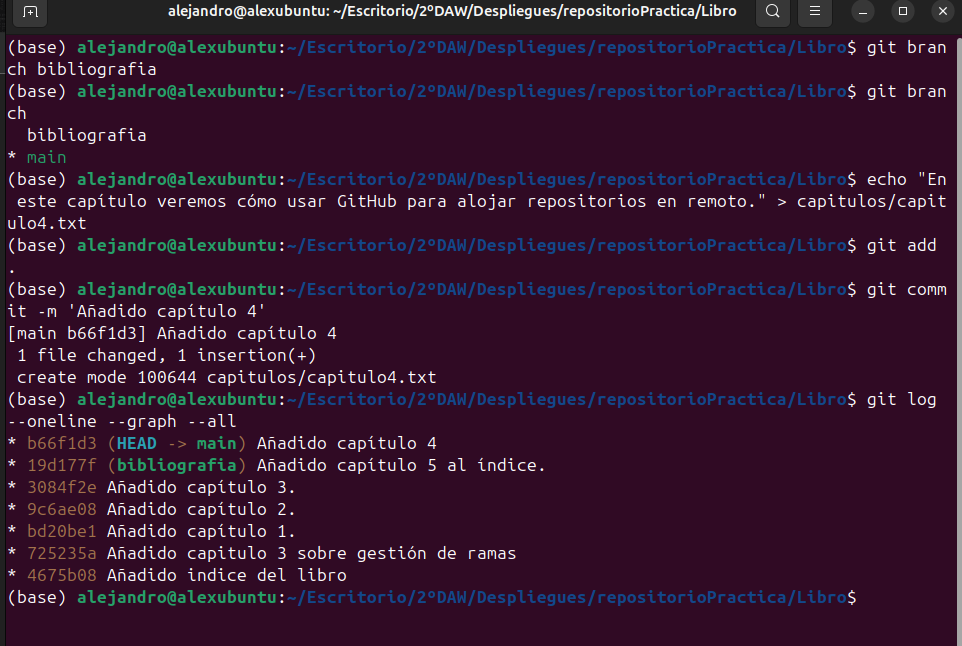

#### Comandos utiles. 
- git restore: deshacer cambios y volver a la versión anterior. 
- git restore --staged: quitar los cambios de la zona temporal pero mantenerlos en el directorio de trabajo. 
- git reset --soft HEAD~1: Deshacer el último commit pero mantener cambios en el staging. 
- git reset --hard HEAD~1: Deshacer el último commit y eliminar cambios en el directorio de trabajo. 


### Ejercicios de gestión de ramas. 
1. Creamos la rama bibliografia. 

2. Creamos archivo y modificamos,lo añadimos y realizamos un commit con un mensaje, por último, mostraremos la historia del repositorio incluyendo todas las ramas. 


3. Cambiamos de rama a la rama bibliografía. Creamos el fichero y añadimos los cambios, haremos un commit y mostraremos la historia del repositorio incluyendo todas las ramas. 

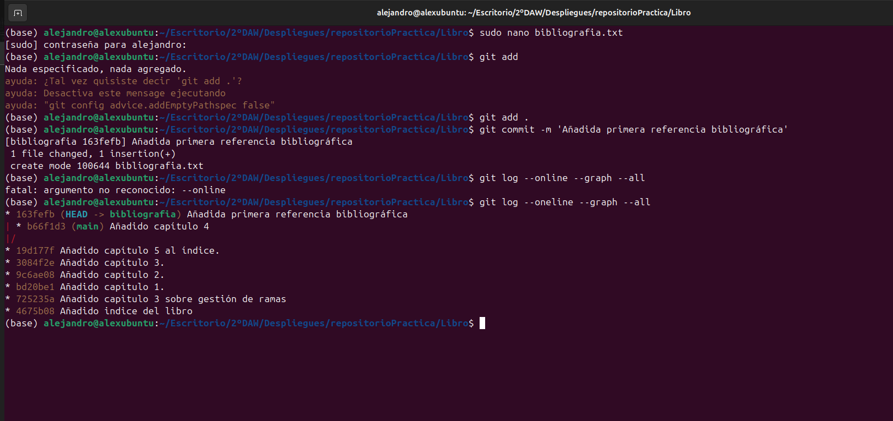

4. Fusionamos la rama bibliografía con la main, y luego la eliminaremos y mostramos la historia del repositorio incluyendo todas la ramas. 

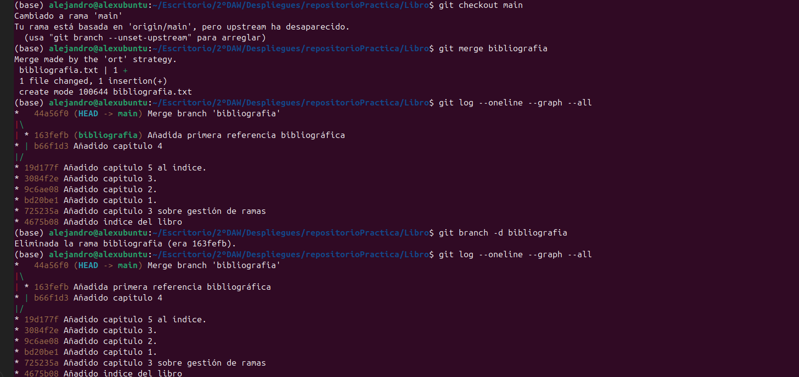

5. En este apartado trabajaremos los posibles conflictos que puede tener el merge con la rama main y no has hecho los cambios adecuados. 

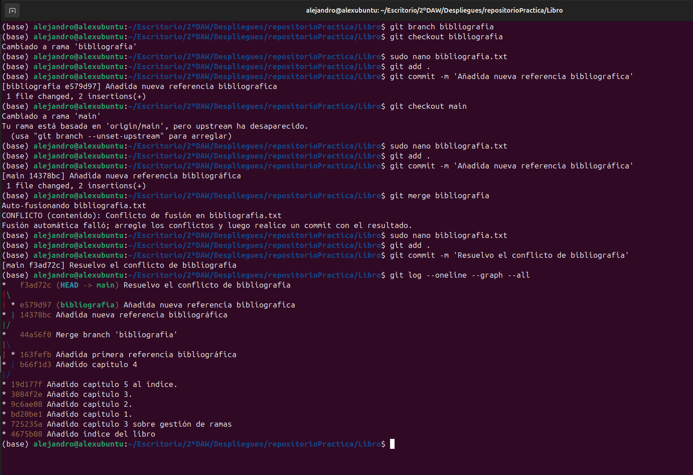

#### Comandos utiles. 
- git branch : Para listar las ramas.
- git branch  &lt;nombreRama&gt;; Para crear una rama.
- git checkout &lt;nombreRama&gt;; Para cambiar a esa rama. 
- git merge &lt;nombreRama&gt;; Para fusionar rama con main. 
- git branch -d &lt;nombreRama&gt;; Eliminar una rama. 


### Ejercicios de repositorios remotos. 
1. Creamos un repositorio, lo añadimos al repositorio local del libro y mostraos todos los repositorios remotos configurados. 
2. Añadimos los cambios al repositorio local de github y accedemos a github para su comprobación. 

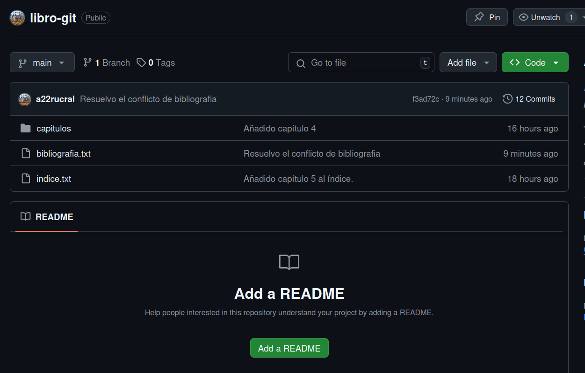

3. Colaboraremos en el repositorio remoto de un compañero, lo clonaremos y añadiremos el fichero autores.txt que contenga el nombre del usuario y su correo electrónico. lo añadimos a la zona de intercambio temporal y haremos un commit con un mensaje. Subiremos los cambios al repositorio remoto. 
4. Bifurcaremos el repositorio en github, clonaremos el repositorio en la cuenta creada, crearemos una rama autoria y la activaremos. Añadiremos el nombre y email al archivo autores.txt, añadimos los cambios a la zona temporal y haremo sun commit. Subiremos los cambios de la rama autoria y tras esto haremos un Pull request. 

#### Comandos utiles. 
- git remote add origin url; Para enlazar un repositorio de github con uno local. 
-git remote -v : Mostrar todos los repositorios remotos configurados. 
- git push -u origin &lt;rama&gt;: Subir los cambios a la rama. 
- git clone url: clonar el repositorio a tu carpeta. 