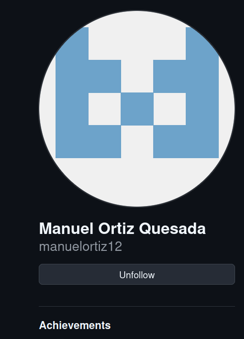

# Práctica 5.1 Github 
## Ejercicios de Git y Github. 

### Configuración Repositorio

Creamos un repositorio con nombre DEAW. 


Lo clonamos en nuestro repositorio local.


### Manejo Repositorio

Crearemos un readme.md, que nos servirá para tener una descripción del proyecto / documentación. 


Tras esto lo añadiremos todo a la preparación y haremos un commit con el siguiente comando. 


A continuación, con todo preparado, ejecutaremos el siguiente comando para la subida de archivos al repositorio en la nube. 


Ahora crearemos el archivo y la carpeta que no queremos que se suba a github. 


Para que no se suba, existe un archivo, .gitignore, que lo que hace es decirle a git que tipo de archivos o directorios deben ser ignorados y no incluirlos al commit. Con la siguiente manera le decimos que ni privado.txt ni el directorio privada se subirán al repositorio. 


Crearemos un tag con el siguiente comando. Esto nos será de utilidad para marcar un commit de un repositorio para señalizar las versiones y ver el progreso. 


### Manejo Social Github.

Edición de perfil, nos pondremos una foto de perfil. 


Ajustaremos la configuración de seguridad para que sea de autenticación en dos pasos. 


También podremos seguir a nuestros compañeros de trabajo o referentes y darle estrellas a sus repositorios. 




### Manejo Git. 

Estos dos usuarios seguidos previamente los pondremos en el readme.md en formato de tabla con un enlace a su github. 


Crearemos la rama V0.2.  Esto nos permitirá gestionar y organizar el desarrollo de nuestro trabajo. 


Editaremos el archivo y le haremos un push desde la rama. Tras esto haremos un git merge para fusionar la rama con la rama principal y unificar el trabajo. 


En este caso hemos hecho cambios en el mismo archivo a la vez en distintas ramas de forma que cuando la intentas unificar dará error de conflicto, como en la siguiente captura. 


Ejecutaremos los siguientes comandos para listar las ramas unidas a main y las que no.


Al irnos de nuevo al archivo nos saldrá de la siguiente manera indicandonos el conflicto entre ramas. Simplemente lo editaremos y arreglaremos el conflicto. 


Crearemos un tag que se llama igual que la rama **v0.2**, y la subiremos, pero con una aclaración, ya que le tienes que indicar si te refieres a la rama o al tag. Se lo indicaremos de la siguiente manera como viene en el comando. 

```console
git push origin refs/tags/v0.2  // Para indicarle tag.
git push origin refs/heads/v0.2 // Para indicarle rama.
```


Borraremos la rama v0.2 indicandole que es la rama como anteriormente hemos explicado.


Ejecutaremos el git log para mostrar el historial de los commits.


--decorate : Ayuda a identificar en que rama o tag se encuentra cada commit. 
--graph: Muestra una representación gráfica del historial de commits. Incluye líneas y ramas para visualizar como están conectados los commits. 
--oneline: Muestra cada commit en una sola línea. 
--all: Muestra el historial de todas las ramas, no solo de en la que se encuentra. 


